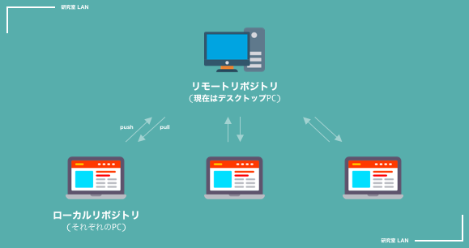
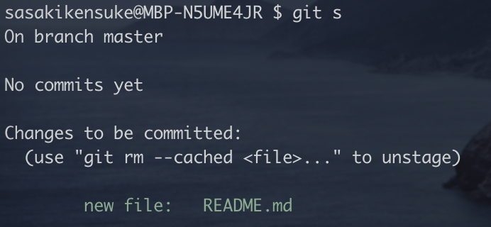
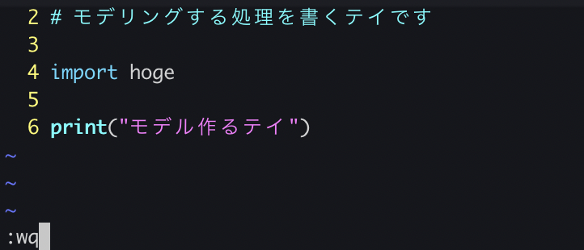
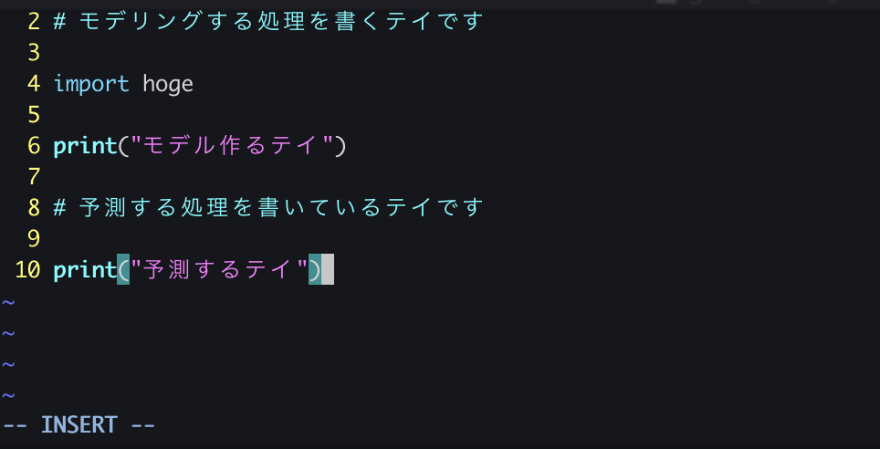
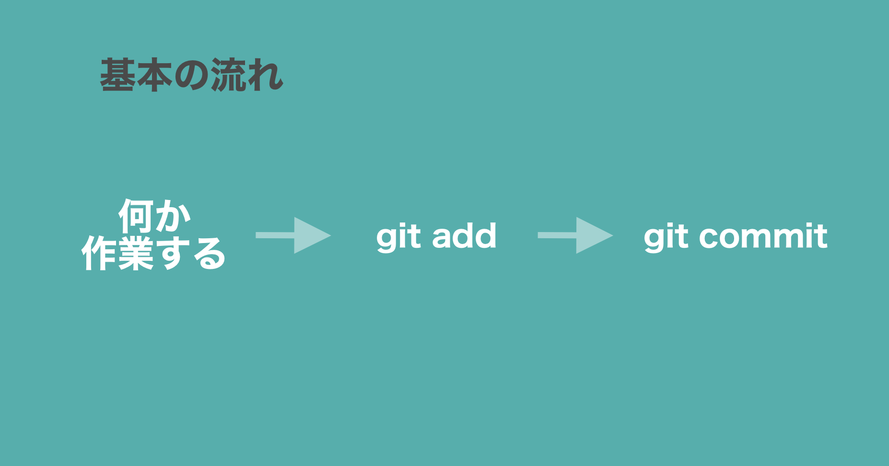

<!-- size: 4:3 -->

<style>
    @font-face
    {
        font-family: banana;
        src: url('./assets/bananaslip.otf')
    }
    section {
        background:#F5BF6A;
        color:#333333;
        font-family: 'banana', 'Noto Sans CJK JP';
        /* font-family: 'Monaco'; */
        justify-content: flex-start;
    }
    h1{
        color:#060000;
    }
    h5 {
        background: #333333;
        color: #F1F0EE;
        text-align: center;
        padding: 5px 0px 5px 0px;
        width: 40%;
    }
    p{
        color:#060000;
    }
    li {
        list-style-type: none;
    }
    li:before {
        content: '';
        width: 6px;
        height: 6px;
        display: inline-block;
        border-radius: 100%;
        background: #060000;
        position: relative;
        left: -15px;
        top: -5px;
    }
    table {
        padding: inherit;
    }
    th {
        background: #D5EBDC;
        color: #2A2B25;
        font-size: 18px;
    }
    td{
        color: #2A2B25;
        font-size: 14px;
    }
</style>

<style scoped>
    section {
        justify-content: center;
    }
    p{
        text-align: center;
        margin-top: 10%;
        font-size: 18px;
    }
</style>

# Git/Gitlab Hands-on

- 今日のゴール
- Gitとは
- Gitlabとは
- 1人でGit
- 2人でGit

2019.11.06

---

# 目標

## 1. Gitをさわったことがある状態にする
## 2. 今後、Gitでコードを管理するようになる

---

<style scoped>
    h6 {
        margin-bottom:0px;
        margin-top:15px;
        color: #333333;
    }
    li {
        margin-bottom: 0px;
        margin-top: 0px;
    }
</style>

# 今日やること

###### 1. Git/Gitlabのかんたんな説明
###### 2. 用意するもの確認
###### 3. 1人でコードを管理してみる
- init → add → commit
- プロジェクトをつくってみる
- remoteにpushする
- 一個前までもどしてみる

###### 4. 2人でコードを管理してみる
- プロジェクトを作ってmemberを加えてみる
- siritori.txtを共同編集する
    
---

<style scoped>
    li {
        font-size: 20px;
    }
    ul {
        margin-bottom: 0px;
    }
    h2 {
        text-align: center;
        margin-top: 20px;
    }
</style>

# Gitとは

- ソースコードの変更履歴を記録・追跡するためのシステム
- リーナス・トーバルズによって開発された(2005年)

## 

---

# Gitを使うとこんないいことある

- いい感じにバックアップできる
    - PCがこわれてもなんとかなる
- 「さっきまで動いてたのに」みたいな時にその時もどまでもどれる
    - NASではバックアップはできるけどもどったりはできない(多分普通にやる分には)
- PCが使えなくなっても、外部サーバーにあるデータからすぐに複製できる

---

# Gitlabとは

- Githubにインスパイアされて作られたgithubみたいなやつ
- 今研究室で使ってるのは `Gitlab CE` の方
    - Windows PCがアプリケーションのサーバーになっていて、そのPCのフォルダにコードとかが保存されていく感じになってる

|種類|概要|
|--|--|
|Gitlab|Githubと同様、Gitlab Incの提供するサーバーにコードを保管するタイプのやつ|
|Gitlab Community Edition|オープンソース、自前でサーバーを用意するので、自分たちのところで完結する|

---

# 1人でGit

## 用意するもの

#### 1. terminal (powershellとか)

##### COMMAND
の次に書いてるコマンドを実行してください

---

# 1人でGit

- ファイルを作ってgitで管理してみる

流れ

```
0. フォルダ作る
1. gitを初期化する
2. ファイルを作成
3. ファイルになんかする
4. ファイルを管理対象にする
5. その時点を保存する
```

---

# 1人でGit

```
0. フォルダ作る
```

<br>
フォルダを作ってそのフォルダまで移動する

##### COMMAND

```
$ mkdir gitlab_handson_sample
$ cd gitlab_handson_sample
```
もしくは
```
$ mkdir gitlab_handson_sample; cd $_
```

---

# 1人でGit

```
1. gitを初期化する
```

<br>
以下のコマンドでローカルリポジトリを新規作成する

→ `.git`ファイルが作成される

##### COMMAND

```
$ git init
```
以下のような表示がでればok
> Initialized empty Git repository in <path>

---

# 1人でGit

```
2. ファイルを作成
```

今のディレクトリに`README.md`を作成する

##### COMMAND

```
$ touch README.md
```
---

<style scoped>
    h2 {
        text-align: center;
        margin-top: 10px;
    }
</style>

# 1人でGit

```
3. ファイルになんかする
```

##### 作業

- 何かしらのeditorでREADME.mdに何か書く

```
$ vim README.md
```
+ `a` + `何か書く` + `q` + `コロン(:)` + `wq`

## 

---

# 1人でGit

```
4. ファイルを管理対象にする
```

管理するファイルに追加(add)するイメージ

##### COMMAND

```
$ git add README.md
```

---

<style scoped>
    h2 {
        text-align: center;
        margin-top: 20px;
    }
</style>
# 1人でGit

```
4. ファイルを管理対象にする
```

状態を確認してみる
```
$ git status
```

## 


---

# 1人でGit

```
5. その時点を保存する
```

その前にusernameとmailをなんとなく入力する(おそらくgitlabに登録した時のやつでok、違っても大丈夫そう)

##### COMMAND

```
$ git config --global user.name "<Your Name>"
$ git config --global user.email <your-address@example.com"
```
---

# 1人でGit

```
5. その時点を保存する
```

##### COMMAND

```
$ git commit -m "<なんの変更を加えたかのメモ>"
```
たとえば
```
$ git commit -m "[update] タイトルを追記した"
```

## 

---

# 1人でGit

- ここまでで以下の`0~5`が完了

```
0. フォルダ作る
1. gitを初期化する
2. ファイルを作成
3. ファイルになんかする
4. ファイルを管理対象にする
5. その時点を保存する
```

ここまで終わったら、作業するごとに`3~5`を繰り返していく感じ

```
3. モデル作る処理を追加する
4. `git add <file>`
5. `git commit -m "<メッセージ>"
```
---

- ちょっとやってみる

---
<style scoped>
    h2 {
        text-align: center;
    }
</style>

# 1人でGit

```
3. モデル作る処理を追加する
```

やってみる

##### 作業

```
$ vim modeling.py
```
+ `a` + `何か書く` + `q` + `コロン(:)` + `wq`

## 

---

# 1人でGit

```
4. `git add <file>`
```

やってみる

##### COMMAND

```
$ git add modeling.py
```

---

# 1人でGit

```
5. `git commit -m "<メッセージ>"
```

やってみる

##### COMMAND

```
git commit -m "[update] modeling"
```

## 

---

- さらに変更してみる

---

# 1人でGit

```
3. 予測する処理を加えてみる
```

##### COMMAND

```
$ vim modeling.py
```
+ `a` + `何か書く` + `q` + `コロン(:)` + `wq`

## 

---

# 1人でGit

```
4. git add <file>
```

ファイルを管理下に追加する

##### COMMAND

```
$ git add modeling.py
```

---

# 1人でGit

```
5. `git commit -m "<メッセージ>"
```

その時点を保存する

```
$ git commit -m "[update] prediction"
```

---

<style scoped>
    h2 {
        margin-top: 0px;
    }
</style>

# 1人でGit

以下の流れを繰り返してその時々の変更を保存していく

## 

---

# 1人でGit

- 諸事情で、modelingの処理を追加したところまで戻りたくなった
- 戻るための手順

```
0. git log でハッシュを確認
1. git reset でもどる
```

---

# 1人でGit

```
0. git log でハッシュを確認
```

以下のcommandでcommit(ある時点)のハッシュが得られる
予測のなんかを加えたcommitのハッシュは`63671c0`
モデリングのなんかを加えた時のハッシュは`fbcb81f`

##### COMMAND

```
$ git log --oneline
```

## 

---

# 1人でGit

```
1. git reset でもどる
```

ハッシュを指定して戻る

##### COMMAND

```
$ git reset --hard fbcb81f
```

## 

---

# 1人でGit

```
1. git reset でもどる
```

ハッシュを指定して戻る

##### COMMAND

```
$ git reset --hard fbcb81f
```
## 

---


正直ここまでできれば、ローカルPCでバージョン管理はできてる

→ ここから、リモートリポジトリにコードを保存してみる

---

# 1人でGit

- リモートリポジトリにコードを保存する

```
0. プロジェクトを作成する
1. リモートリポジトリを登録する
2. リモートにコードを保存する(push)
```

---

<style scoped>
    h6 {
        text-align: center;
        font-size: 250px;
    }
</style>

# 1人でGit

```
0. プロジェクトを作成する
```

###### 実演

---

# 1人でGit まとめ

- 作業 → `git add` → `git commit` のサイクルを続ける
- 区切りがきたら、`git push origin master`でリモートに保存
- 上の作業をしながら分析・開発すると、以下のメリットがある
    - PCが壊れてもバックアップできる
    - ある時点まで戻れる
    
---

# 2人でGit